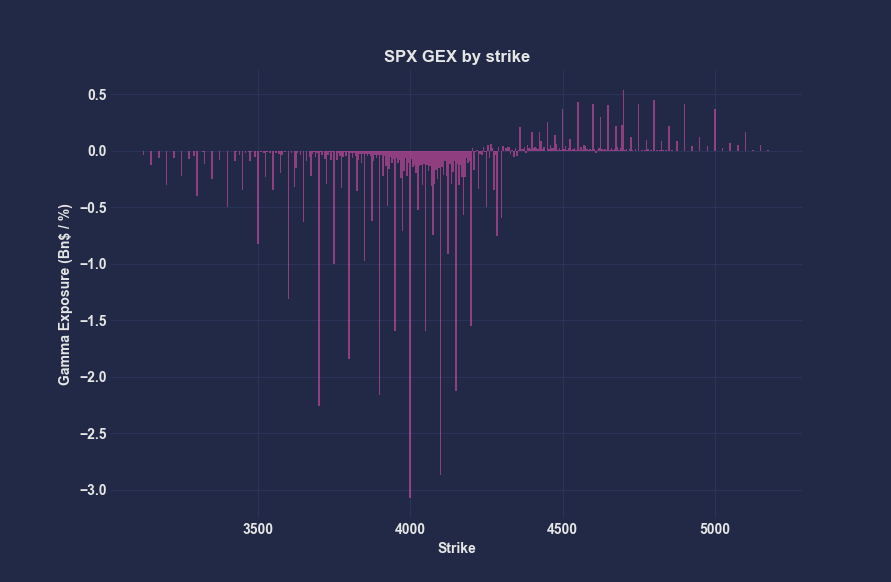
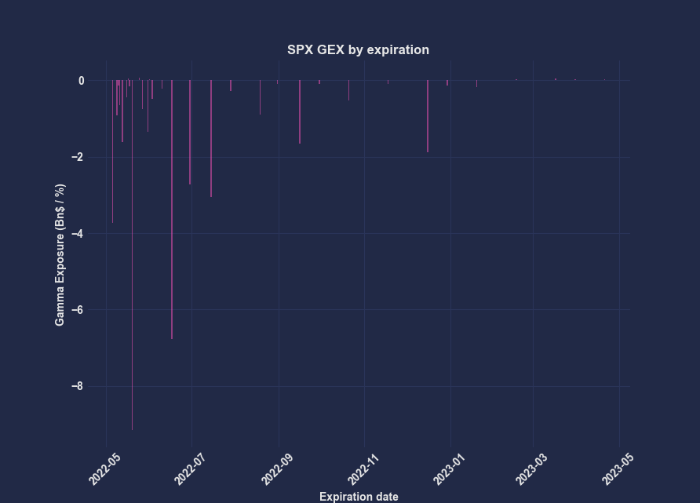
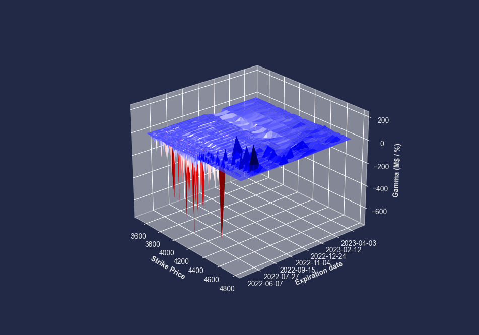

# Gamma Exposure Tracker
Python script to scrape option data from CBOE website and track current dealers' notional gamma exposure (GEX).

To calculate the total exposure we assume that dealers are long calls and short puts, hence:
* Call gamma = spot price * gamma * open interest * contract size * spot price * 0.01
* Put gamma = - spot price * gamma * open interest * contract size * spot price * 0.01

## How to run
1. Clone the repository or download it as ZIP file
2. Run ```pip install -r requirements.txt``` (optional)
3. Run ```main.py```

## Requirements
* `pandas`
* `requests`
* `matplotlib`

## Examples

Input: 
```bash
python main.py <ENTER>
Enter desired ticker: SPX <ENTER>
```

Output: 

```bash
Total notional GEX: $-38.1193 Bn
```

<p align="center">
  
</p>

<p align="center">
  
</p>

<p align="center">
  
</p>